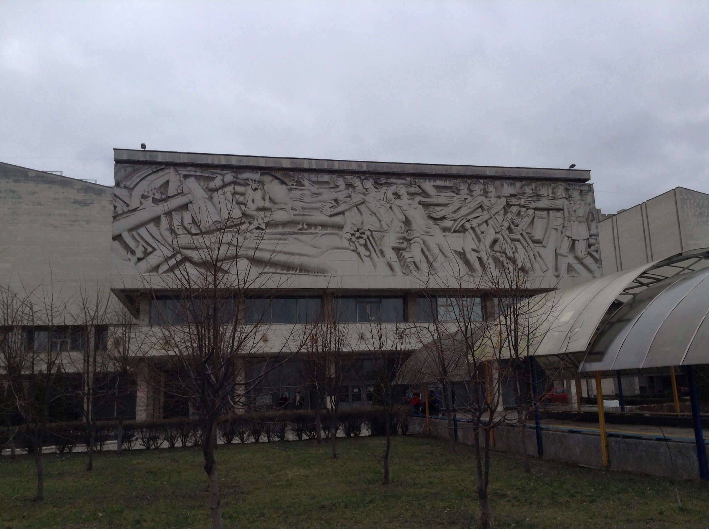
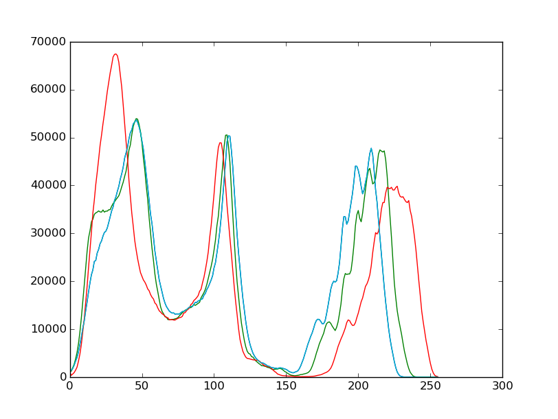

# Lab 2

Implements lab 2 from image processing course. 

### How to run
The lab is fully built on `matplotlib` python library. You have to install it to use it. Install the image processing module and so on. 
Then you can just type `python main.py`. It could take some time to transform picture so I have already provided resized one.

### What does it does

It makes histogram of [picture](pic1.jpg).

### File walkthrough

*not needed - everything is in main.py file*

### Result of lab

#### Input

#### Output

