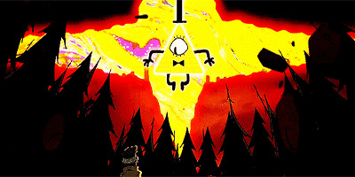
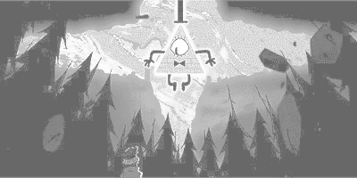

# Lab 3

Implements lab 2 from image processing course. 

### How to run
Since there is some libraries needed to run it, run those steps to run the lab
```bash
virtualenv --clear --prompt="[lab3]" .env
source .env/bin/activate
pip install -r requirements.txt
``` 
Then you can just type `python main.py`. It could take some time to transform picture so I have already provided resized one.

### What does it does

It makes black and white normalization of [picture](pic1.jpg).

### File walkthrough

*not needed - everything is in main.py file*

### Result of lab

#### Input



#### Output



