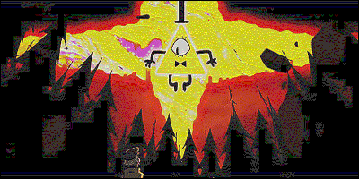

# Lab 4

Implements lab 4 from image processing course. 

### How to run
Since there is some libraries needed to run it, run those steps to run the lab
```bash
virtualenv --clear --prompt="[lab4]" .env
source .env/bin/activate
pip install -r requirements.txt
``` 
Then you can just type `python main.py`. It could take some time to transform picture so I have already provided resized one.

### What does it does

Applies sharpeless filter on [picture](pic1.jpg).

### File walkthrough

*not needed - everything is in main.py file*

### Result of lab

The algorythm works pretty awful. It cracks picture while it should make it more sharp

#### Input


#### Output


